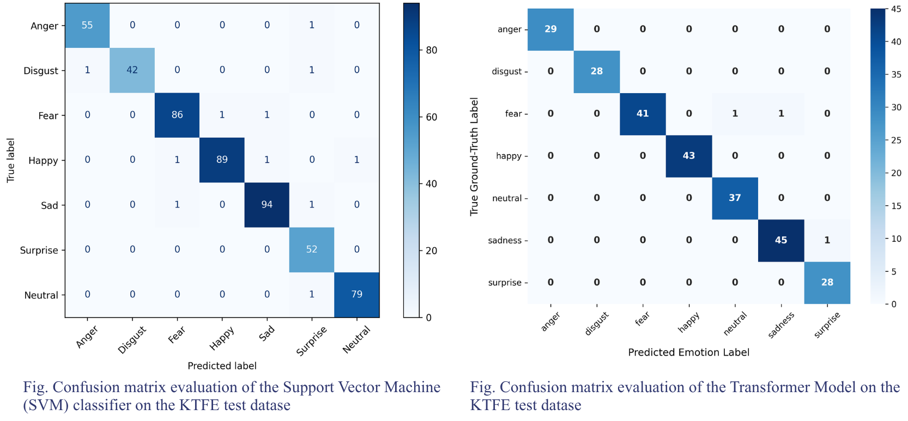

# Thermal Facial Emotion Recognition on KTFE: SVM vs Vision Transformer

Comparison of a classical model (SVM) and a deep learning model
(Vision Transformer) for emotion classification from thermal face images
in the KTFE dataset.

This was done during a research internship at NIT Rourkela under the supervision of Dr. Anwesha Sengupta.

## Dataset
KTFE (Kotani Thermal Facial Emotion) database: 2,538 thermal images of
26 people, 7 classes (Anger, Disgust, Fear, Happy, Sad, Surprise, Neutral).
Created by Nguyen et al. Not created by me and **not included in this repo**.
 
[H. Nguyen, F. Chen, K. Kotani, and B. Le, "Fusion of visible images and
thermal image sequences for automated facial emotion estimation,"
*Journal of Mobile Multimedia*, vol. 10, no. 3-4, pp. 294-308, 2014.]

## Notebooks
| File | Model |
|---|---|
| `svm_ktfe.ipynb` | RBF-kernel SVM on pixel intensities |
| `transformer_ktfe.ipynb` | ViT-B/16, partial fine-tuning |

## Method

**SVM**
- Resize to 64x64, grayscale, scale to [0,1], Gaussian blur (5x5)
- Flatten to a 4,096-dimensional vector
- Stratified 80/20 split (`random_state=42`), StandardScaler fitted on train only
- SVC: RBF kernel, C=10, gamma='scale', class_weight='balanced', one-vs-one

**Vision Transformer**
- Pretrained ViT-B/16 (12 layers, ~86M parameters), input 224x224x3
- Partial fine-tuning: layers 0-10 and patch embedding frozen; layer 11 and
  the classification head (dropout 0.1 + linear) trained
- 80/10/10 split (2,030 train / 254 val / 254 test), batch size 32
- AdamW (lr 1e-4, weight decay 1e-3), cosine annealing, best checkpoint by
  validation accuracy (epoch 4)
- Trained on Google Colab (T4 GPU)

## Results (test set)
| Model | Test accuracy | Macro F1 | Test size |
|---|---|---|---|
| SVM | 97.83% | 0.98 | 508 |
| ViT-B/16 | 98.82% | 0.9891 | 254 |

Fear, Happy and Neutral were among the best-classified classes by both models
(Fear had the lowest ViT recall at 0.9535, with 2 misclassified samples).

## Limitations
- **Image-level random split:** images of the same person can appear in both
  train and test, so these scores probably overestimate performance on
  unseen people. A subject-wise split is needed to test that.
- **The two models used different splits** (20% vs 10% test), so the
  0.99-point gap between them is small and not a strict comparison.

## How to run
1. Download KTFE Dataset (not included here)
2. Set the dataset path in the first cells of each notebook.
3. Run in Google Colab or Jupyter.

## Tools
Python, scikit-learn, PyTorch, OpenCV
